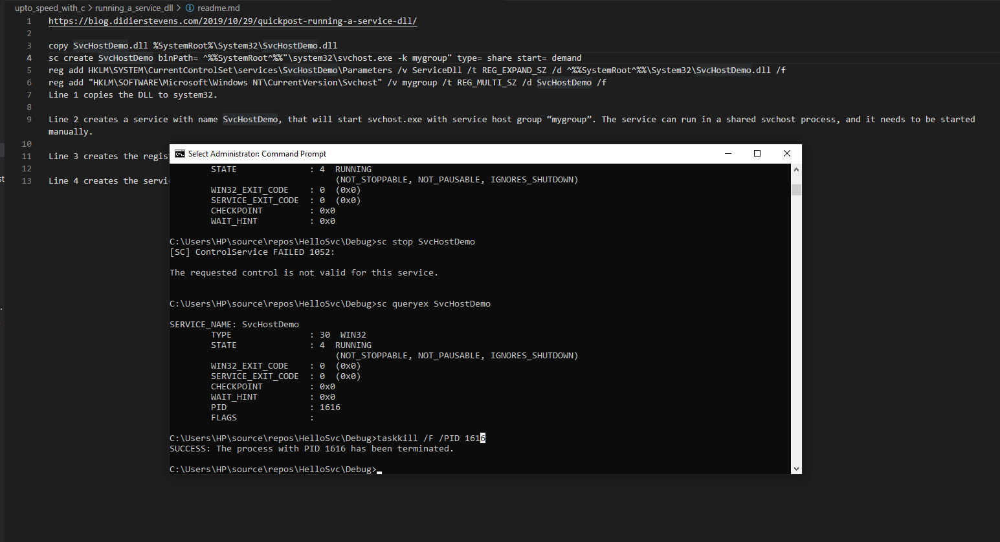

https://blog.didierstevens.com/2019/10/29/quickpost-running-a-service-dll/

copy SvcHostDemo.dll %SystemRoot%\System32\SvcHostDemo.dll
sc create SvcHostDemo binPath= ^%%SystemRoot^%%"\system32\svchost.exe -k mygroup" type= share start= demand
reg add HKLM\SYSTEM\CurrentControlSet\services\SvcHostDemo\Parameters /v ServiceDll /t REG_EXPAND_SZ /d ^%%SystemRoot^%%\System32\SvcHostDemo.dll /f
reg add "HKLM\SOFTWARE\Microsoft\Windows NT\CurrentVersion\Svchost" /v mygroup /t REG_MULTI_SZ /d SvcHostDemo /f
Line 1 copies the DLL to system32.

Line 2 creates a service with name SvcHostDemo, that will start svchost.exe with service host group “mygroup”. The service can run in a shared svchost process, and it needs to be started manually.

Line 3 creates the registry entry ServiceDll referring to SvcHostDemo.dll.

Line 4 creates the service host group “mygroup” under the key for svchost. This service host group contains the service SvcHostDemo.

- Replace SystemRoot with your C:\Windows 

- ensure that you are compiling for windows x64

- to kill an unkillable process find the process Id with `sc queryex servicename`

- Use taskkill /f /pid <PROCESS ID> to kill the process.

