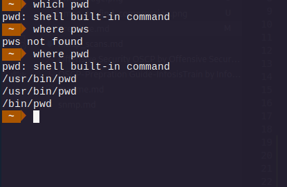

# Chapter 2

in lab you have to find `network-secret.txt` files.

`which` command

checks $PATH and then if a match is found returns the actual path.

`locate` command

looks up from locate.db file to find location of any command. this locate.db is constantly updates by cron scheduler.

`adduser` command to adduser

`usermod -aG sudo newuser`

adding firefox to default location.

### 2.4.3.4 Exercises
1. Use man to look at the man page for one of your preferred commands.


2. Use man to look for a keyword related to file compression.


using man to find compression


3. Use which to locate the pwd command on your Kali virtual machine.


4. Use locate to locate wce32.exe on your Kali virtual machine.


5. Use find to identify any file (not directory) modified in the last day, NOT owned by the root 
user and execute ls -l on them. Chaining/piping commands is NOT allowed!

```
find $HOME -mtime 0 -not -user root 

```

Dont know how to do ls -l.

Check why am I not able to commit with git.


## Services

Starting kali linux services

`sudo systemctl start ssh`

`ss -antlp | grep sshd` 

`sudo systemctl enable ssh`

`sudo systemctl start apache2`

`systemctl list-unit-files`


### 2.5.3 Exercises
Penetration Testing with Kali Linux 2.0
PWK 2.0 Copyright © Offensive Security Ltd. All rights reserved. 45
1. Practice starting and stopping various Kali services.
2. Enable the SSH service to start on system boot.

```
sudo systemctl enable ssh          INT ✘  18s   
Synchronizing state of ssh.service with SysV service script with /lib/systemd/systemd-sysv-install.
Executing: /lib/systemd/systemd-sysv-install enable ssh
Created symlink /etc/systemd/system/sshd.service → /lib/systemd/system/ssh.service.
Created symlink /etc/systemd/system/multi-user.target.wants/ssh.service → /lib/systemd/system/ssh.service.
```

## searching installing removing tools

`sudo apt update`

`sudo apt upgrade`

`sudo apt-cache search pure-ftd`

`apt show resource-agents`

`apt install pure-ftd`

`apt remove --purge pure-ftpd`

`sudo dpkg -i `

### 2.6.6.1 Exercises
(Reporting is not required for these exercises)
1. Take a snapshot of your Kali virtual machine (optional).
done
2. Search for a tool not currently installed in Kali.
conda not installed
3. Install the tool.
   
4. Remove the tool.
   
5. Revert Kali virtual machine to previously taken snapshot (optional).
done

