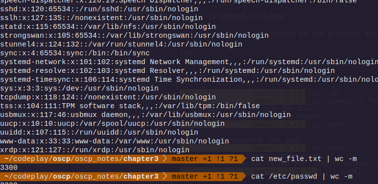
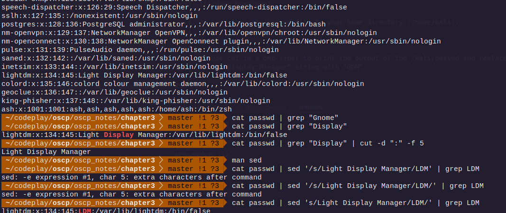

## Environement variables

`echo $PATH`
`echo $USER`
`echo $PWD`
`echo $HOME`

`export ashwin="master"`

The export command makes the variable accessible to any subprocesses we might spawn from
our current Bash instance. If we set an environment variable without export it will only be available
in the current shell.
We will use the $$ variable to display the process ID of the current shell instance to make sure that
we are indeed issuing commands in two different shells:

```
 ~/codeplay/oscp  master +1 !1 ?1  echo$$                                                                                                                                   1 ✘  11s   
zsh: command not found: echo9503
 ~/codeplay/oscp  master +1 !1 ?1  echo $$                                                                                                                                      127 ✘   
9503
 ~/codeplay/oscp  master +1 !1 ?1  $$                                                                                                                                               ✔   
zsh: command not found: 9503

 ~/codeplay/oscp  master +1 !1 ?1  bash                                                                                                                                         127 ✘   
ash@hlkali:~/codeplay/oscp$ echo $$
16553
ash@hlkali:~/codeplay/oscp$ echo $ip
10.10.6.233
```

`env`

`history`

Rather than re-typing a long command from our history, we can make use of the history expansion
facility. For example, looking back at Listing 34, there are three commands in our history with a line
number preceding each one. To re-run the first command, we simply type the ! character followed
by the line number, in this case 1, to execute the cat /etc/lsb-release command:

```
ash@hlkali:~/codeplay/oscp$ history
    1  echo $$
    2  echo $ip
    3  env
    4  history
ash@hlkali:~/codeplay/oscp$ !1
echo $$
16553
```

By default, the command history is saved to the .bash_history file in the user home directory. Two
environment variables control the history size: HISTSIZE and HISTFILESIZE.
HISTSIZE controls the number of commands stored in memory for the current session and
HISTFILESIZE configures how many commands are kept in the history file. These variables can be
edited according to our needs and saved to the Bash configuration file (.bashrc) that we will explore
later.
One of the simplest ways to explore the Bash history is right from the command line prompt. We
can browse through the history with some useful keyboard shortcuts with the two most common
being:

command reverse search

```
 ~/c/oscp  master +1 !1  systemctl list-unit-files                100 ✘   
bck-i-search: un_

```
### 3.1.3.2 Exercises
1. Inspect your bash history and use history expansion to re-run a command from it.
2. Execute different commands of your choice and experiment browsing the history through
the shortcuts as well as the reverse-i-search facility.

## Piping and redirection

Every program run from the command line has three data streams connected to it that serve as
communication channels with the external environment. These streams are defined as follows:
Stream Name Description

Standard Input (STDIN) Data fed into the program
Standard Output (STDOUT) Output from the program (defaults to terminal)
Standard Error (STDERR) Error messages (defaults to terminal)

Table 3 - Streams connected to command line programs
Piping (using the | operator) and redirection (using the > and < operators) connects these streams
between programs and files to accommodate a near infinite number of possible use cases.

```
 ~/c/oscp/o/chapter3  master +1 !1 ?1  echo "test" > redirection.txt  ✔   
 ~/c/oscp/o/chapter3  master +1 !1 ?1  cat redirection.txt            ✔   
test

```

using `>>`

redirecting from a file 

`wc -m < redirection.txt`

```
 ~/c/oscp/o/chapter3  master +1 !1 ?1  wc -m < redirection.txt        ✔   
5

```

## Redirecting STDERR

According to the POSIX54 specification, the file descriptors55 for the STDIN, STDOUT, and STDERR
are defined as 0, 1, and 2 respectively. These numbers are important as they can be used to
manipulate the corresponding data streams from the command line while executing or joining
different commands together.
To get a better grasp of how the file descriptor numbers work, consider this example that redirects
the standard error (STDERR)


```
ls ./test 2>error.txt
```

```
 ~/c/oscp/o/chapter3  master +1 !1 ?1  ls ./test 2>error.txt      INT ✘   
 ~/c/oscp/o/chapter3  master +1 !1 ?1  cat error.txt                2 ✘   
ls: cannot access './test': No such file or directory

```

## piping output

`cat error.txt | wc -m`

```
 ~/c/oscp/o/chapter3  master +1 !1 ?1  cat error.txt | wc -m          ✔   
54

```


### 3.2.5.1 Exercises
1. Use the cat command in conjunction with sort to reorder the content of the /etc/passwd
file on your Kali Linux system.


2. Redirect the output of the previous exercise to a file of your choice in your home directory



## text searching and manipulation

`grep`

`sed`

```
 ~/codeplay/oscp  master !1  echo "I need to enumerate hard" | sed 's/hard/harder/'                                                                                             0|1 ✘   
I need to enumerate harder
```

`cut`

```
 ~/codeplay/oscp  master !1  echo "I need to enumerate hard" | cut -f 2 -d ' '                                                                                                  0|1 ✘   
need
```

`awk`

```
echo "hello::there::friend" | awk -F "::" '{print $1, $3}'
```

```
gunzip access_log.txt.gz
  187  dir
  188  cat access_log.txt
  189  cat access_log.txt | cut -d " " -f 1 | sort -u 
  190  cat access_log.txt | cut -d " " -f 1 | sort | uniq -c | sort -urn
  191  cat access_log.txt | grep "208.68.234.99"
```

### 3.3.5.1 Exercises
1. Using /etc/passwd, extract the user and home directory fields for all users on your Kali
machine for which the shell is set to /bin/false. Make sure you use a Bash one-liner to print
the output to the screen. The output should look similar to Listing 53 below:
kali@kali:~$ YOUR COMMAND HERE...
The user mysql home directory is /nonexistent
The user Debian-snmp home directory is /var/lib/snmp
The user speech-dispatcher home directory is /var/run/speech-dispatcher
The user Debian-gdm home directory is /var/lib/gdm3
Listing 53 - Home directories for users with /bin/false shells


2. Copy the /etc/passwd file to your home directory (/home/kali).

done

3. Use cat in a one-liner to print the output of the /kali/passwd and replace all instances of the
“Gnome Display Manager” string with “GDM”.



## Editing from command line

`nano`

`vi`

## Comparing files

`comm`


`diff`


`vimdiff`


### 3.5.3.1 Exercises
1. Download the archive from the following URL https://offensive-security.com/pwkfiles/scans.tar.gz

page not found 

2. This archive contains the results of scanning the same target machine at different times.
Extract the archive and see if you can spot the differences by diffing the scans.

page not found

## managing Process

The Linux kernel manages multitasking through the use of processes. The kernel maintains
information about each process to help keep things organized, and each process is assigned a
number called a process ID (PID).
The Linux shell also introduces the concept of jobs69 to ease the user’s workflow during a terminal
session. As an example, cat error.txt | wc -m is a pipeline of two processes, which the shell
considers a single job. Job control refers to the ability to selectively suspend the execution of jobs 

sending process to background

`&`

jobs

`jobs`

Second, the use of “%1” in the fg %1 command is new. There are various ways to refer to a job in
the shell. The “%” character followed by a JobID represents a job specification. The JobID can be a
process ID (PID) number or you can use one of the following symbol combinations:
• %Number : Refers to a job number such as %1 or %2
• %String : Refers to the beginning of the suspended command’s name such as
%commandNameHere or %ping
• %+ OR %% : Refers to the current job
• %- : Refers to the previous job
Note that if only one process has been backgrounded, the job number is not needed.

`ps -ef`
`ps -aux`
The -ef73 options we used above stand for:
• e: select all processes
• f: display full format listing (UID, PID, PPID, etc.)

`$ ps -fC leafpad`

`kill`

