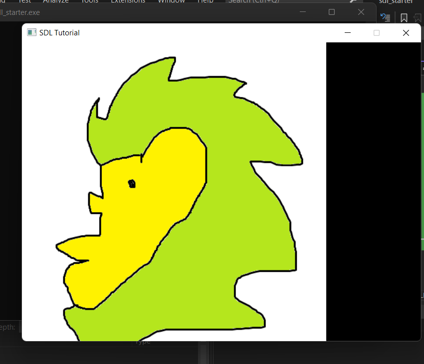

# trying to use winapi

https://docs.microsoft.com/en-us/windows/win32/learnwin32/your-first-windows-program

failed : not running in dev cpp

### new.cpp

new.cpp creates a window, this works.


## Introduction to windows service applications

Microsoft Windows services, formerly known as NT services, enable you to create long-running executable applications that run in their own Windows sessions. These services can be automatically started when the computer boots, can be paused and restarted, and do not show any user interface.

https://www.c-sharpcorner.com/article/create-windows-services-in-c-sharp/

failed : This also did not go according to plan.

## Creating a MFC appliCATION

Starting initial application:


failed : It didnt work was too complicated. Did not work.

## working with SDL and C++

https://lazyfoo.net/tutorials/SDL/

Able to compile sdl


step 1. download SDL libs http://libsdl.org/download-2.0.php
step 2. you need to add the SDL include folder to the Visual C++ include directories. in properties.
step 3. The header file tells the compiler what the SDL functions are, not where to find them. The library file tells the compiler where they are and we need to tell it to use the SDL library file. Go to Configuration Properties -> Linker -> Additional Dependencies -> Edit. Add SDL2.lib and SDL2main.lib.
step 4. While we did tell Visual C++ to use the SDL library files, we didn't tell it where to find it. Add the library directory like you did the include directory. inside properties library directory add x64 lib folder.
step 5. This is because your application needs SDL2.dll to run but can't find it. Windows uses environment variables to define where to look for dll files. To edit the PATH environment variable, go into Windows Settings and search for edit the system environment variables.
x64 lib.

Need to give full path of image to be loaded.
Was able to load the image.



## Code for handling multiple inputs

```C
/*This source code copyrighted by Lazy Foo' Productions (2004-2022)
and may not be redistributed without written permission.*/

//Using SDL and standard IO
#include <SDL.h>
#include <stdio.h>
#include <string>

//Screen dimension constants
const int SCREEN_WIDTH = 640;
const int SCREEN_HEIGHT = 480;

enum KeyPressSurfaces
{
	KEY_PRESS_SURFACE_DEFAULT,
	KEY_PRESS_SURFACE_UP,
	KEY_PRESS_SURFACE_DOWN,
	KEY_PRESS_SURFACE_LEFT,
	KEY_PRESS_SURFACE_RIGHT,
	KEY_PRESS_SURFACE_TOTAL,
};

//Starts up SDL and creates window
bool init();

//Loads media
bool loadMedia();

//Frees media and shuts down SDL
void close();

//The window we'll be rendering to
SDL_Window* gWindow = NULL;

//The surface contained by the window
SDL_Surface* gScreenSurface = NULL;

//The image we will load and show on the screen
SDL_Surface* gXOut = NULL;

SDL_Surface* loadSurface(std::string path);

SDL_Surface* gKeyPressSurfaces[KEY_PRESS_SURFACE_TOTAL];

SDL_Surface* gCurrentSurface = NULL;


SDL_Surface* loadSurface(std::string path) {
	SDL_Surface* loadedSurface = SDL_LoadBMP(path.c_str());
	if (loadedSurface == NULL) {
		printf("Unable to load Image. Inside loadSurface.");
	}
	return loadedSurface;
}

bool init()
{
	//Initialization flag
	bool success = true;

	//Initialize SDL
	if (SDL_Init(SDL_INIT_VIDEO) < 0)
	{
		printf("SDL could not initialize! SDL_Error: %s\n", SDL_GetError());
		success = false;
	}
	else
	{
		//Create window
		gWindow = SDL_CreateWindow("SDL Tutorial", SDL_WINDOWPOS_UNDEFINED, SDL_WINDOWPOS_UNDEFINED, SCREEN_WIDTH, SCREEN_HEIGHT, SDL_WINDOW_SHOWN);
		if (gWindow == NULL)
		{
			printf("Window could not be created! SDL_Error: %s\n", SDL_GetError());
			success = false;
		}
		else
		{
			//Get window surface
			gScreenSurface = SDL_GetWindowSurface(gWindow);
		}
	}

	return success;
}

bool loadMedia()
{
	//Loading success flag
	bool success = true;

	//Load default surface
	gKeyPressSurfaces[KEY_PRESS_SURFACE_DEFAULT] = loadSurface("D:\\Downloads\\04_key_presses\\04_key_presses\\press.bmp");

	if (gKeyPressSurfaces[KEY_PRESS_SURFACE_DEFAULT] == NULL) {
		printf("Failed to load the default image!");
		success = false;
	}

	gKeyPressSurfaces[KEY_PRESS_SURFACE_UP] = loadSurface("D:\\Downloads\\04_key_presses\\04_key_presses\\up.bmp");

	if (gKeyPressSurfaces[KEY_PRESS_SURFACE_UP] == NULL) {
		printf("Failed to load the default image!");
		success = false;
	}

	gKeyPressSurfaces[KEY_PRESS_SURFACE_DOWN] = loadSurface("D:\\Downloads\\04_key_presses\\04_key_presses\\down.bmp");

	if (gKeyPressSurfaces[KEY_PRESS_SURFACE_DOWN] == NULL) {
		printf("Failed to load the default image!");
		success = false;
	}

	gKeyPressSurfaces[KEY_PRESS_SURFACE_LEFT] = loadSurface("D:\\Downloads\\04_key_presses\\04_key_presses\\left.bmp");

	if (gKeyPressSurfaces[KEY_PRESS_SURFACE_LEFT] == NULL) {
		printf("Failed to load the default image!");
		success = false;
	}

	gKeyPressSurfaces[KEY_PRESS_SURFACE_RIGHT] = loadSurface("D:\\Downloads\\04_key_presses\\04_key_presses\\right.bmp");

	if (gKeyPressSurfaces[KEY_PRESS_SURFACE_RIGHT] == NULL) {
		printf("Failed to load the default image!");
		success = false;
	}


	return success;
}

void close()
{
	//Deallocate surface
	SDL_FreeSurface(gXOut);
	gXOut = NULL;

	//Destroy window
	SDL_DestroyWindow(gWindow);
	gWindow = NULL;

	//Quit SDL subsystems
	SDL_Quit();
}

int main(int argc, char* args[])
{
	//Start up SDL and create window
	if (!init())
	{
		printf("Failed to initialize!\n");
	}
	else
	{
		//Load media
		if (!loadMedia())
		{
			printf("Failed to load media!\n");
		}
		else
		{
			//Main loop flag
			bool quit = false;

			//Event handler
			SDL_Event e;

			gCurrentSurface = gKeyPressSurfaces[KEY_PRESS_SURFACE_DEFAULT];


			//While application is running
			while (!quit)
			{
				//Handle events on queue
				while (SDL_PollEvent(&e) != 0)
				{
					//User requests quit
					if (e.type == SDL_QUIT)
					{
						quit = true;
					}
					else if (e.type == SDL_KEYDOWN) {
						switch (e.key.keysym.sym) {
						case SDLK_UP:
							gCurrentSurface = gKeyPressSurfaces[KEY_PRESS_SURFACE_UP];
							break;
						
						case SDLK_DOWN:
							gCurrentSurface = gKeyPressSurfaces[KEY_PRESS_SURFACE_DOWN];
							break;

						case SDLK_LEFT:
							gCurrentSurface = gKeyPressSurfaces[KEY_PRESS_SURFACE_LEFT];
							break;

						case SDLK_RIGHT:
							gCurrentSurface = gKeyPressSurfaces[KEY_PRESS_SURFACE_RIGHT];
							break;

						}
					}

				}

				//Apply the image
				SDL_BlitSurface(gCurrentSurface, NULL, gScreenSurface, NULL);

				//Update the surface
				SDL_UpdateWindowSurface(gWindow);
			}
		}
	}

	//Free resources and close SDL
	close();

	return 0;
}

```


