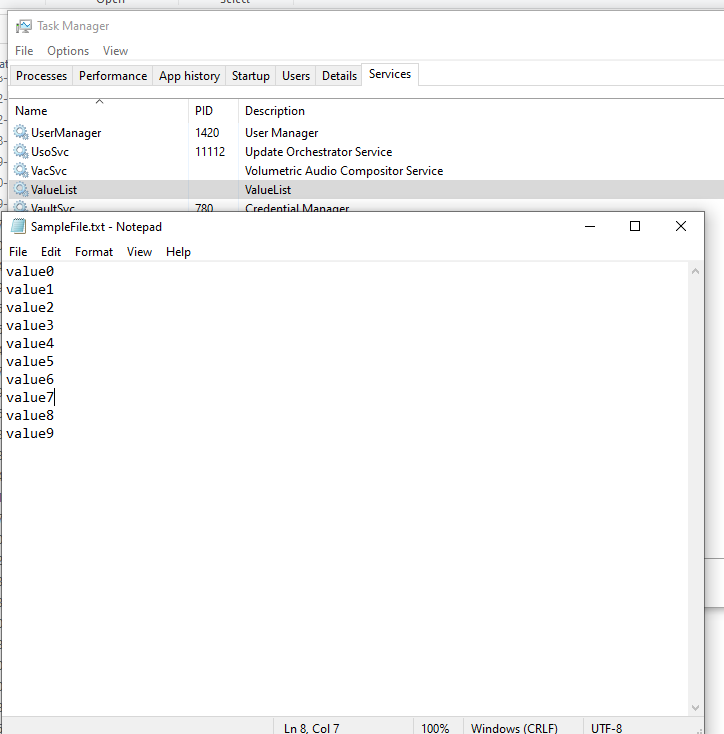
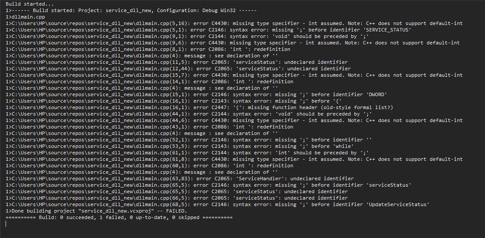
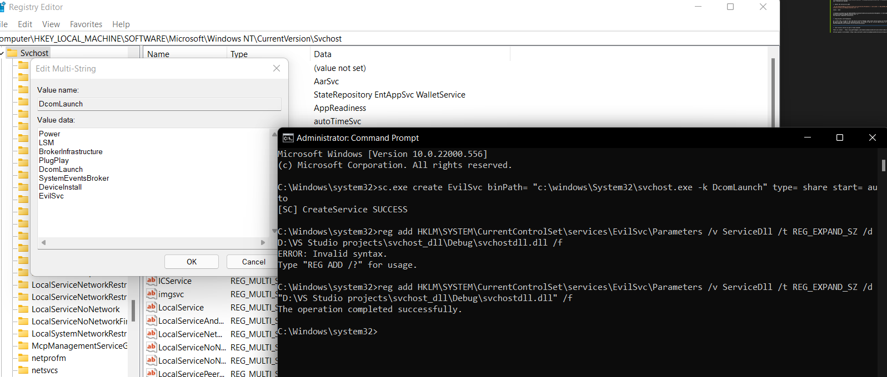
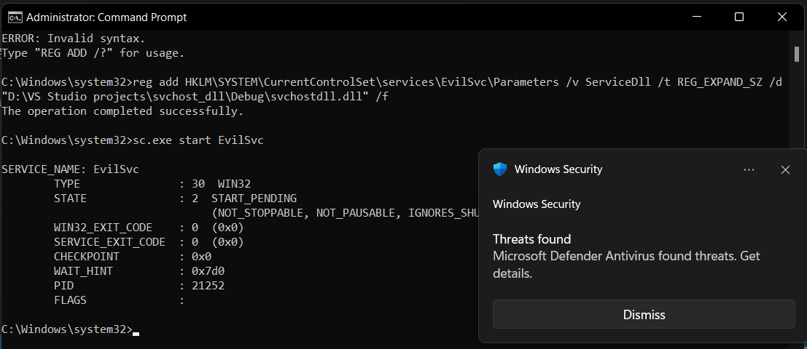
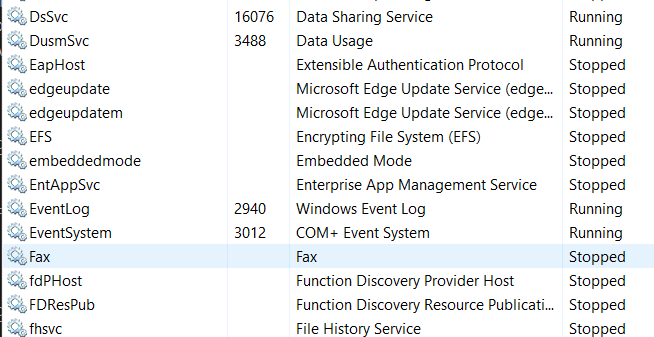
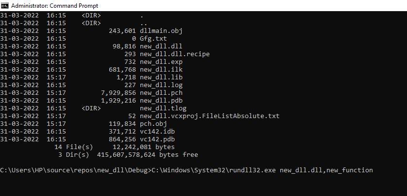

# trying to use winapi

https://docs.microsoft.com/en-us/windows/win32/learnwin32/your-first-windows-program

failed : not running in dev cpp

### new.cpp

new.cpp creates a window, this works.


## Introduction to windows service applications

Microsoft Windows services, formerly known as NT services, enable you to create long-running executable applications that run in their own Windows sessions. These services can be automatically started when the computer boots, can be paused and restarted, and do not show any user interface.

https://www.c-sharpcorner.com/article/create-windows-services-in-c-sharp/

failed : This also did not go according to plan.


Lets create a smaple service 

https://www.codeproject.com/Articles/499465/Simple-Windows-Service-in-Cplusplus

sc create ValueList binPath=C:\Users\HP\Downloads\SampleService\Debug\SampleService.exe

Successfully added service - 


verifying the service - 



## Creating a MFC appliCATION

Starting initial application:


failed : It didnt work was too complicated. Did not work.

## working with SDL and C++

https://lazyfoo.net/tutorials/SDL/

Able to compile sdl


step 1. download SDL libs http://libsdl.org/download-2.0.php
step 2. you need to add the SDL include folder to the Visual C++ include directories. in properties.
step 3. The header file tells the compiler what the SDL functions are, not where to find them. The library file tells the compiler where they are and we need to tell it to use the SDL library file. Go to Configuration Properties -> Linker -> Additional Dependencies -> Edit. Add SDL2.lib and SDL2main.lib.
step 4. While we did tell Visual C++ to use the SDL library files, we didn't tell it where to find it. Add the library directory like you did the include directory. inside properties library directory add x64 lib folder.
step 5. This is because your application needs SDL2.dll to run but can't find it. Windows uses environment variables to define where to look for dll files. To edit the PATH environment variable, go into Windows Settings and search for edit the system environment variables.
x64 lib.

Need to give full path of image to be loaded.
Was able to load the image.


## Code for handling multiple inputs


# Persisting with svchost.exe with a service dll servicemain

Create a service EvilSvc.dll DLL (the DLL that will be loaded into an svchost.exe) with the code we want executed on each system reboot
Create a new service EvilSvc with binPath= svchost.exe
Add the ServiceDll value to EvilSvc service and point it to the service DLL compiled in step 1
Modify HKLM\SOFTWARE\Microsoft\Windows NT\CurrentVersion\Svchost to specify under which group your service should be loaded into
Start EvilSvc service
The EvilSvc is started and its service DLL EvilSvc.dll is loaded into an svchost.exe

https://www.ired.team/offensive-security/persistence/persisting-in-svchost.exe-with-a-service-dll-servicemain

failed:

 
Theory on svchost :  https://www.geoffchappell.com/studies/windows/win32/services/svchost/index.htm?tx=21%2C22

official guide on servicehost: https://docs.microsoft.com/en-us/windows/win32/services/writing-a-servicemain-function

1. Another attempt at creating a service dll

https://github.com/apriorit/SvcHostDemo/blob/master/src/SvcHostDemo/SvcHostDemo.cpp

status : Build succeeded on this.

2. So lets now create a service Evilsvc

`sc.exe create EvilSvc binPath= "c:\windows\System32\svchost.exe -k DcomLaunch" type= share start= auto`

status : done

```
C:\Windows\system32>sc.exe create EvilSvc binPath= "c:\windows\System32\svchost.exe -k DcomLaunch" type= share start= auto
[SC] CreateService SUCCESS
```

3. modify the service dll path

`reg add HKLM\SYSTEM\CurrentControlSet\services\EvilSvc\Parameters /v ServiceDll /t REG_EXPAND_SZ /d "D:\VS Studio projects\svchost_dll\Debug\svchostdll.dll" /f`

status : done

```
C:\Windows\system32>reg add HKLM\SYSTEM\CurrentControlSet\services\EvilSvc\Parameters /v ServiceDll /t REG_EXPAND_SZ /d "C:\Users\HP\source\repos\svchost_dll\Debug\svchost_dll.dll" /f
The operation completed successfully.

```
4. Group EvilSvc with DcomLaunch

As a final step, we need to tell the Service Control Manager under which service group our EvilSvcshould load. 
We want it to get loaded in the DcomLaunch group, so we need to add our service name EvilSvc in the list of services in the DcomLaunch value in HKLM\SOFTWARE\Microsoft\Windows NT\CurrentVersion\Svchost

status : added




5. start evilsvc service as part of dcom launcher

`sc.exe start EvilSvc`



status : Didnot registre as service with antivirus enabled



We can create a dll and find what is not working.

creating a benign dll that creates a file.




